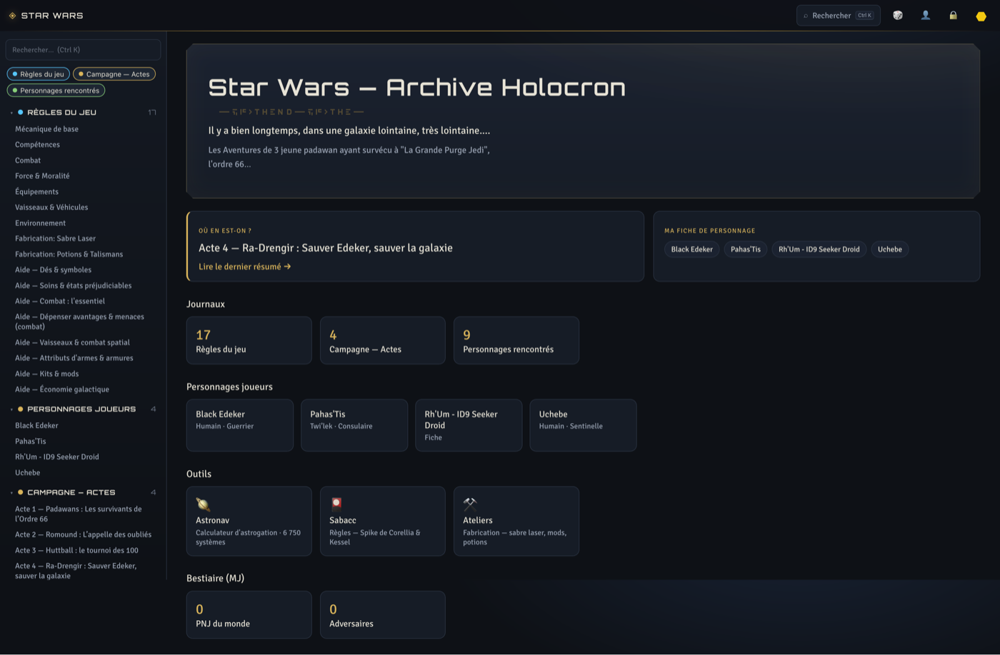
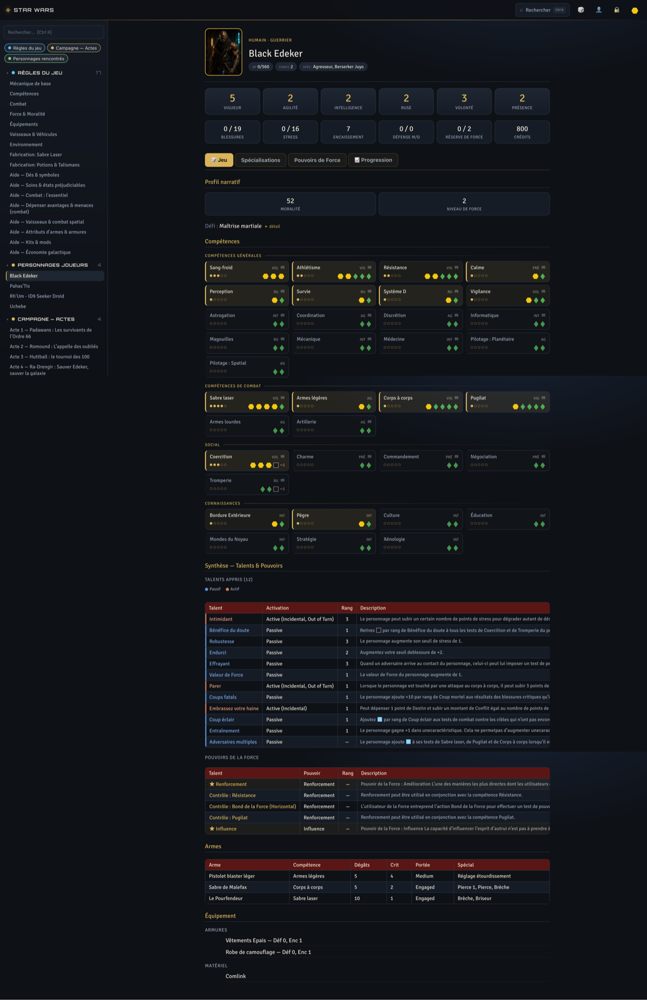
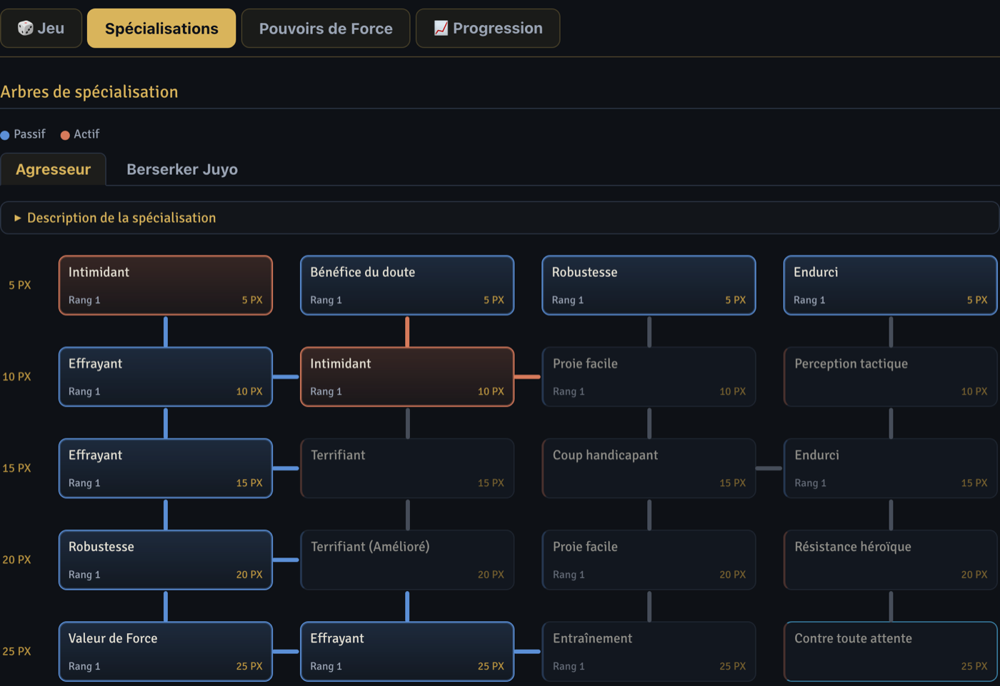
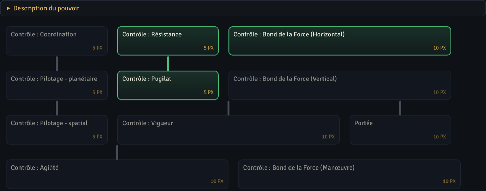
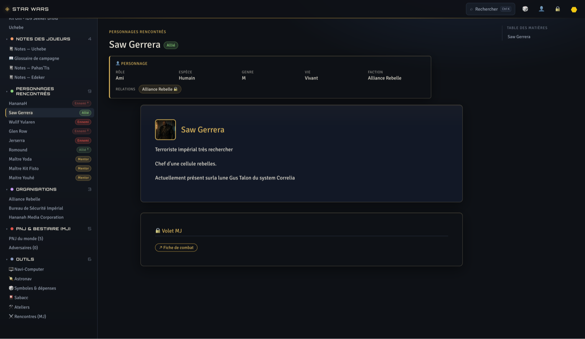
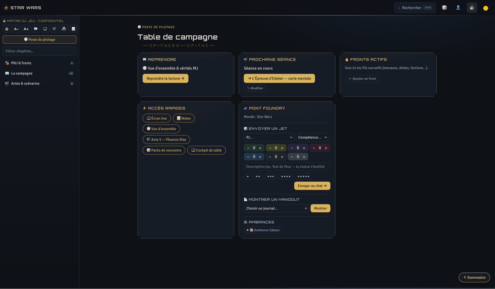
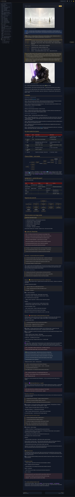

# swffg-holocron

**Campaign companion for Star Wars FFG on FoundryVTT** — a beautiful, fast, player-facing
web archive where **Foundry is the single source of truth**. The Holocron pulls your world
(journals, actors, compendiums, config) into a synced cache, displays it as a polished
campaign site, and writes back (GM bible editor, player notes, dice rolls, ship state).

*Interface in French (FFG FR terminology) — contributions for i18n welcome.*

## Screenshots

|  |  |
|---|---|
| <br>**Player home** — journals, PCs, tools (Astronav, Sabacc, Workshops) | <br>**Character sheet** — stats, skills with dice pools, talents, weapons, gear |
| <br>**Specialization trees** — passive/active talents | <br>**Force power tree** — purchased nodes highlighted |
| <br>**NPC dossier** — role/faction, relations, portrait, GM panel | <br>**GM cockpit** — Foundry bridge (send a roll, handouts, ambiances), fronts |
| <br>**GM bible chapter** — mind map, secrets diagram, act scenario |  |

## Features

- 📖 **Player archive** — rules compendium, campaign acts, organizations, encountered NPCs,
  each pulled live from Foundry journals & packs (ownership-aware: players only see what
  Foundry lets them see).
- 🔐 **Login with Foundry accounts** — same credentials as the game. GM role unlocks the
  GM space; players see & edit *their own* notes; rolls are signed with their name.
- 🎲 **Dice** — FFG dice generator, roll-to-Foundry-chat (prefilled pool the player opens
  in game), GM roll panel per PC skill.
- 🗺️ **Astronav** — astrogation calculator over ~6 750 canon systems and hyperlanes:
  A\* routing, FFG difficulty (v1.2 house sheet), travel time, ship resources, hostile-zone
  avoidance. Interactive galaxy map.
- 🚀 **Shared ship state** — canonical in a Foundry journal flag, mutated from the web or
  from Foundry macros, with chat log.
- 🧙 **GM cockpit** — bible chapters (rubriques = your Foundry folders) with a rich web
  editor that **saves into Foundry**, session screen, private notes, fronts, handout push,
  playlist control, combat tracker.
- ⚡ **Fast** — SyncStore: memory+disk cache, background sync, ETag/304, instant cold boot.
  No MCP call ever blocks a page load.

## Architecture (1 minute)

```
Foundry (SSOT) ⇄ connector (foundry-mcp fork, stdio child or HTTP gateway)
                     ⇅ sequential queue
              SyncStore (mem + disk cache, targeted sync)
                     ⇅
         /api/content/* · /api/gm/* · /api/foundry/* · /api/astro/*
                     ⇅
              vanilla JS front (this repo, zero build step)
```

- Campaign specifics (categories, packs, NPC registry, planets…) live in a Foundry journal
  **« ⚙️ Holocron Config »** (`flags.holocron.config`) — `POST /api/gm/bootstrap` creates it.
- The connector is [wanoo/foundry-vtt-mcp](https://github.com/wanoo/foundry-vtt-mcp)
  (fork of [TheStranjer/foundry-vtt-mcp](https://github.com/TheStranjer/foundry-vtt-mcp))
  with `keep_id`, pack reads, hosted deployment, heartbeat & reconnect patches.

## Quick start

### 1. Foundry side — install the module (does everything)

In Foundry **Setup → Add-on Modules → Install Module**, paste the manifest:

```
https://github.com/wanoo/swffg-holocron/releases/latest/download/module.json
```

Foundry will offer to install the required dependencies:
[swffg-astronavigation](https://github.com/wanoo/swffg-astronavigation) (galaxy map &
astrogation), [Monk's Enhanced Journal](https://foundryvtt.com/packages/monks-enhanced-journal)
(typed sheets & bookmarks) and
[fvtt-party-resources](https://foundryvtt.com/packages/fvtt-party-resources) (shared pools).
System: `starwarsffg` (v12/13).

Enable the module and load your world as GM: **the bootstrap runs itself** — key campaign
folders, 🚀 ship POI / codex / HoloNet journals, the full rules compendium imported into
the world, 20 key canon dates for the timeline, the ⚙️ Holocron Config journal completed,
technical journals filed into the system folder. Every key folder, compendium and journal
is adjustable afterwards in the **module settings** (name or `Folder.<id>` uuid) — no JSON
editing, ever. Re-run anytime via the *« Installer / réinstaller »* settings menu.

Finally create a dedicated **GM-role bot user** in your world (the web app's connector
logs in as this user).

### 2. Web app side — run the Archive Holocron

Requirements: Node ≥ 20 (or Docker) and network access to your Foundry server.

```bash
git clone https://github.com/wanoo/swffg-holocron && cd swffg-holocron
npm install                     # pulls the MCP connector fork (optional dependency)
cp .env.example .env            # FOUNDRY_BASE_URL, bot credentials, SESSION_SECRET
npm start
```

Open http://localhost:8080 and log in with any Foundry account of the world. Content
appears as the background sync completes (first full sync: a few minutes).

### Docker

Build the image yourself (no image is distributed):

```bash
docker build -t swffg-holocron .
docker run -p 8080:8080 -v holocron-data:/data --env-file .env swffg-holocron
```

### Environment

See [`.env.example`](.env.example). Key variables: `FOUNDRY_BASE_URL`,
`FOUNDRY_CREDENTIALS_JSON` (embedded connector) **or** `FOUNDRY_MCP_URL` (external
gateway), `SESSION_SECRET`, optional legacy `GM_KEY`/`PLAYER_KEY`.

### Instance overlay

Drop optional files in `HOLOCRON_DATA_DIR/overlay/` (served at `/overlay/*`):
`spend-help.json` (advantage/threat spending helper), `compendium.json` (translated
item qualities). These contain licensed FFG text and are **not** distributed here.

## Security notes

- Sessions are HMAC-signed httpOnly cookies; passwords are validated against Foundry's
  own `/join` and never stored.
- Anything uploaded to Foundry's `worlds/` data is publicly reachable **on the Foundry
  host itself** if the URL is known — treat spoiler images accordingly (obscure names).
- The GM asset proxy (`/api/gm/asset/*`) gates spoiler images behind GM auth on the
  Holocron side and caches them on disk.

## CI

The GitHub Actions workflow lives in [`docs/ci.yml`](docs/ci.yml). Pushing workflow
files requires the `workflow` OAuth scope, so activate it once via the GitHub UI
(**Actions → New workflow → set up yourself**, paste the file) or:
`gh auth refresh -s workflow && mkdir -p .github/workflows && git mv docs/ci.yml .github/workflows/ && git commit -am "ci" && git push`.

## License

MIT — see [LICENSE](LICENSE). Star Wars, FFG products and their texts belong to their
respective owners; this project ships **no** copyrighted game content.
